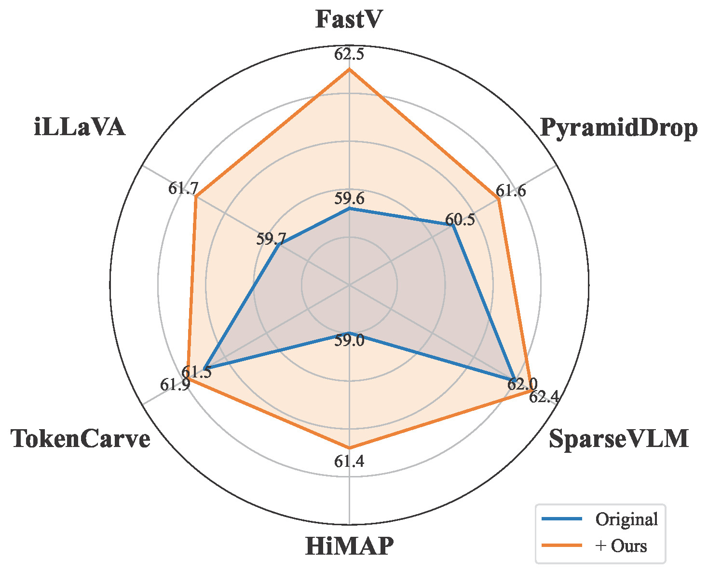
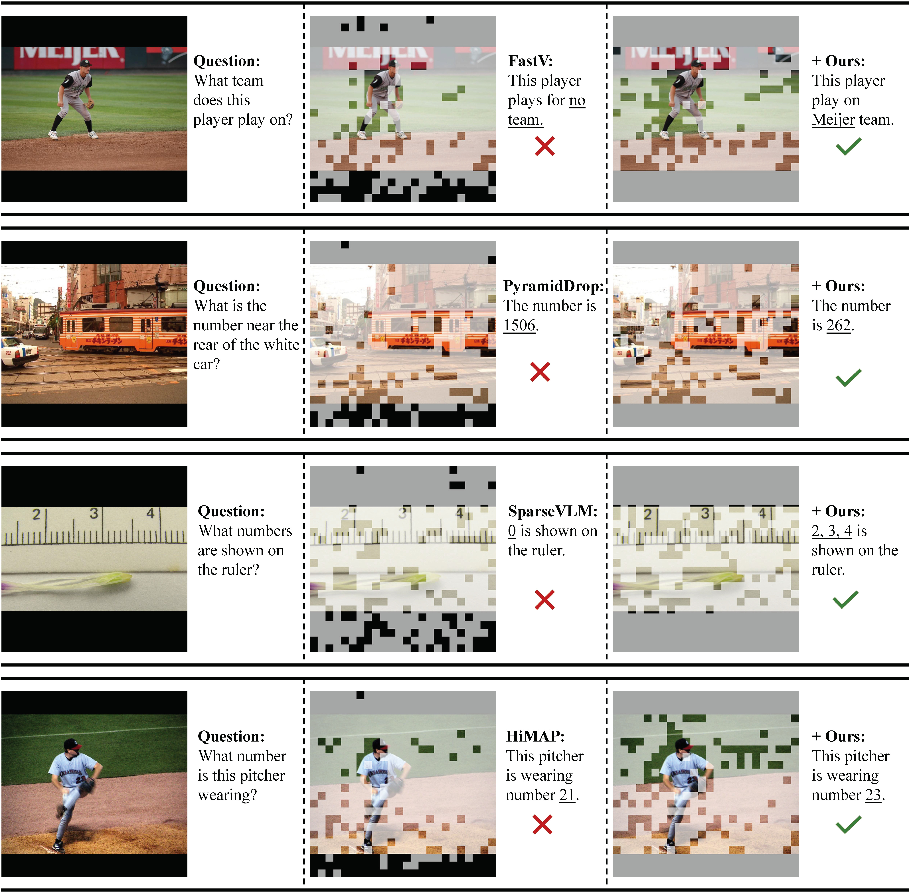

# Attention Debiasing for Token Pruning in Vision–Language Models

Official implementation of the paper: **Attention Debiasing for Token Pruning in Vision–Language Models**.

[](https://github.com/intcomp/attention-bias)
[](https://arxiv.org/abs/2508.17807v2)

---

## 🚀 Overview

Vision–language models (VLMs) typically encode substantially more visual tokens than text tokens, resulting in significant token redundancy. Pruning uninformative visual tokens is therefore crucial for improving computational efficiency. However, we find that attention in VLMs is systematically biased:

1.  **Recency Bias**: It disproportionately favors tokens appearing later in the sequence (over-attention to lower image regions).
2.  **Attention Sink**: It assigns inflated scores to semantically empty padding tokens.

We introduce two lightweight, **training-free**, and **plug-and-play** debiasing techniques that restore the reliability of attention as a pruning criterion.

<p align="center">
  
</p>

---

## ✨ Key Features

-   **Model-Agnostic**: Works across various VLM architectures (LLaVA-v1.5, Video-LLaVA, etc.).
-   **Pruning-Method-Agnostic**: Enhances existing attention-based pruning methods (FastV, PyramidDrop, SparseVLM, HiMAP, TokenCarve, iLLaVA).
-   **Training-Free**: No retraining or fine-tuning required.
-   **Efficient**: Incurs negligible computational overhead.

---

## 🛠️ Installation

### 1. Clone the Repository
```bash
git clone --recursive https://github.com/intcomp/attention-bias.git
cd attention-bias
```

### 2. Apply Submodule Patches
We provide a utility script to apply our debiasing techniques to the integrated pruning baselines:
```bash
bash scripts/apply_patches.sh
```

### 3. Environment Setup
The environment requirements are primarily based on LLaVA. You can follow the installation steps in the respective submodule directories (e.g., `FastV`, `SparseVLMs`). Generally, you will need:
- Python 3.10+
- PyTorch 2.0+
- CUDA 11.7+

---

## 📊 Evaluation

### Dataset Preparation
Please follow the instructions in [LLaVA/Evaluation](https://github.com/haotian-liu/LLaVA/blob/main/docs/Evaluation.md) to download and organize the datasets. Ensure your data structure matches the LLaVA guidelines.

### Running Evaluation
We provide scripts to run evaluations for different pruning methods with our debiasing techniques enabled.

```bash
# Example: Run FastV evaluation
bash scripts/run_fastv.sh

# Example: Run HiMAP evaluation
bash scripts/run_himap.sh
```

Available scripts in `scripts/`:
- `run_fastv.sh`
- `run_himap.sh`
- `run_pdrop.sh`
- `run_sparsevlm.sh`
- `run_tokencarve.sh`

---

## 🖼️ Qualitative Results

Our method effectively suppresses the retention of biased padding or bottom-region tokens and preserves semantically important visual tokens.

<p align="center">
  
</p>

---

## 📝 Citation

If you find our work useful in your research, please consider citing:

```bibtex
@article{zhao2026attention,
  title={Attention Debiasing for Token Pruning in Vision–Language Models},
  author={Zhao, Kai and Yuan, Wubang and Lin, Yuchen and Ruan, Liting and Lu, Xiaofeng and Fan, Deng-Ping and Cheng, Ming-Ming and Zeng, Dan},
  journal={arXiv preprint},
  year={2026}
}
```
